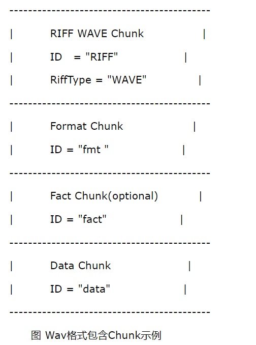

# WAV
wav是一种无损的音频文件格式。它是微软专门为Windows系统定义的波形文件格式（Waveform Audio）。所有的WAV都有一个文件头，这个文件头音频流的编码参数。WAV对音频流的编码没有硬性规定，除了PCM之外，还有几乎所有支持ACM规范的编码都可以为WAV的音频流进行编码  

## WAV和PCM的关系
WAV可以使用多种音频编码来压缩其音频流，不过我们常见的都是音频流被PCM编码处理的WAV，但这不表示WAV只能使用PCM编码，MP3编码同样也可以运用在WAV中，和AVI一样，只要安装好了相应的Decode，就可以欣赏这些WAV了。  
简单来说：pcm是无损wav文件中音频数据的一种编码方式，但wav还可以用其它方式编码。 

## Wave文件的内部结构
WAVE文件是以RIFF(Resource Interchange File Format, "资源交互文件格式")格式来组织内部结构的。  
RIFF文件结构可以看作是树状结构，其基本构成是称为"块"（Chunk）的单元，最顶端是一个“RIFF”块，下面的每个块有“类型块标识(可选)”、“标志符”、“数据大小”及“数据”等项所组成。基本chunk的内部结构如表所示  

| 名称 | Size | 备注 |
| ---- | ---- | ---- |
| 块标志符 | 4 | 4个小写字符(如 "fmt ", "fact", "data" 等) |
| 数据大小 | 4 | DWORD类型,表示后接数据的大小(N Bytes) |
| 数据 | N | 本块中正式数据部分 |
 

每个文件最前端写入的是RIFF块，每个文件只有一个RIFF块。  
非PCM格式的文件会至少多加入一个 "fact" 块，它用来记录数据(注意是数据而不是文件)解压缩后的大小。这个 "fact" 块一般加在 "data" 块的前面。  

WAV文件是由若干个Chunk组成的。按照在文件中的出现位置包括：RIFF WAVE Chunk, Format Chunk, Fact Chunk(可选), Data Chunk。  

## 将录音写成wav格式的文件
	private RandomAccessFile fopen(String path) throws IOException {
	    File f = new File(path);
	
	    if (f.exists()) {
	        f.delete();
	    } else {
	        File parentDir = f.getParentFile();
	        if (!parentDir.exists()) {
	            parentDir.mkdirs();
	        }
	    }
	
	    RandomAccessFile file = new RandomAccessFile(f, "rw");
	    // 16K、16bit、单声道
	    /* RIFF header */
	    file.writeBytes("RIFF"); // riff id
	    file.writeInt(0); // riff chunk size *PLACEHOLDER*
	    file.writeBytes("WAVE"); // wave type
	
	    /* fmt chunk */
	    file.writeBytes("fmt "); // fmt id
	    file.writeInt(Integer.reverseBytes(16)); // fmt chunk size
	    file.writeShort(Short.reverseBytes((short) 1)); // format: 1(PCM)
	    file.writeShort(Short.reverseBytes((short) 1)); // channels: 1
	    file.writeInt(Integer.reverseBytes(16000)); // SamplesPerSec 4字节 采样率
	    file.writeInt(Integer.reverseBytes((int) (1 * 16000 * 16 / 8))); //BytesPerSec 音频数据传送速率, 单位是字节。
																//其值为采样率×每次采样大小。播放软件利用此值可以估计缓冲区的大小。
	    file.writeShort(Short.reverseBytes((short) (1 * 16 / 8))); //BlockAlign 每次采样的大小
				// 采样精度*声道数/8(单位是字节); 这也是字节对齐的最小单位, 
				//譬如 16bit 立体声在这里的值是 4 字节。播放软件需要一次处理多个该值大小的字节数据，以便将其值用于缓冲区的调整。
	    file.writeShort(Short.reverseBytes((short) (1 * 16))); //BitsPerSample 每个声道的采样精度
				//譬如 16bit 在这里的值就是16。如果有多个声道，则每个声道的采样精度大小都一样的。
	
	    /* data chunk */
	    file.writeBytes("data"); // data id
	    file.writeInt(0); // data chunk size *PLACEHOLDER*
	
	    Log.d(TAG, "wav path: " + path);
	    return file;
	}
	
	private void fwrite(RandomAccessFile file, byte[] data, int offset, int size) throws IOException {
	    file.write(data, offset, size);
	    Log.d(TAG, "fwrite: " + size);
	}
	
	private void fclose(RandomAccessFile file) throws IOException {
	    try {
	        file.seek(4); // riff chunk size
	        file.writeInt(Integer.reverseBytes((int) (file.length() - 8)));
	
	        file.seek(40); // data chunk size
	        file.writeInt(Integer.reverseBytes((int) (file.length() - 44)));
	
	        Log.d(TAG, "wav size: " + file.length());
	
	    } finally {
	        file.close();
	    }
	}

## pyton操作wav的库
- PySoundFile [文档](https://pysoundfile.readthedocs.io/en/0.9.0/)   
- scipy.io.wavfile (from scipy)
- wave (to read streams. Included in python 2 and 3)
- scikits.audiolab (that seems unmaintained)
- sounddevice (play and record sounds, good for streams and real-time)
- pyglet

https://stackoverflow.com/questions/2060628/reading-wav-files-in-python

参考：
https://www.cnblogs.com/lidabo/p/3729615.html
https://www.cnblogs.com/ricks/p/9522243.html
https://blog.csdn.net/trbbadboy/article/details/7899651  
https://www.jianshu.com/p/f67f2a9a28b2  