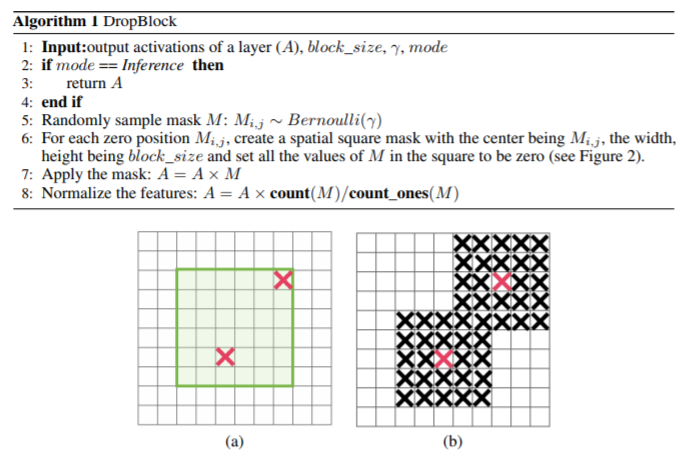

# Dropout
dropout是一种防止模型过拟合的技术，这项技术也很简单，但是很实用，**dropout用于全连接层**。  

dropout是指在模型训练过程中，随机让隐层神经元的输出设置为0，暂时认为这些节点不是网络结构一部分，但会把权重保留下来（不更新）；作用在激活函数之后。以这种方式被抑制的神经元既不参与前向传播，也不参与反向传播    

因此，每次输入一个样本，就相当于该神经网络尝试了一个新结构，但是所有这些结构之间共享权重。因为神经元不能依赖于其他神经元而存在，所以这种技术降低了神经元复杂的互适应关系。因此，网络需要被迫学习更为健壮的特征，这些特征在结合其他神经元的一些不同随机子集时很有用。如果没有 Dropout，我们的网络会表现出大量的过拟合。Dropout 使收敛所需的迭代次数大致增加了一倍。  

预测时需要注意。因为我们训练的时候会随机的丢弃一些神经元，但是预测的时候就没办法随机丢弃了（如果在预测时丢弃，会使结果不稳定，也就是给定一个测试数据，有时候输出a有时候输出b，结果不稳定，这是实际系统不能接受的，用户可能认为你的模型有”bug“）。一种”补偿“的方案就是每个神经元的输出都乘以一个p，这样在”总体上“使得测试数据和训练数据是大致一样的。比如一个神经元的输出是x，那么在训练的时候它有p的概率keep，(1-p)的概率丢弃，那么它输出的期望是p x+(1-p) 0=px。因此测试的时候把这个神经元乘以p可以得到同样的期望。但是这样测试的时候就需要多一次乘法，我们对于训练的实时性要求没有测试那么高。所以更为常见的做法是**训练的时候给U1的每个元素除以p**，相当于给H1放大1/p倍，那么预测的时候，那么后面层的参数学到的就相当于没有dropout的情况，因此预测的时候就不需要再乘以p了  

参考：https://blog.csdn.net/qq_14821323/article/details/80015224

# dropblock
全连接网络加DropOut是一种有效的正则化方法，但将DropOut加到卷积层却往往难以奏效，因为卷积层的特征图中相邻位置元素在空间上共享语义信息，DropOut方法在整幅特征图随机丢弃元素，但与其相邻的元素依然可以保有该位置的语义信息  

为了更加有效丢弃局部语义信息，激励网络学到更加鲁棒有效的特征，应该按块(block)丢弃(drop)，这就是DropBlock的由来。    
  
(b)为使用DropOut的示意图，即在整幅特征图中随机丢弃一些元素的结果，虽然绿色区域有元素被丢弃，但因为特征元素之间空间上的语义信息相关性，这种操作并不能有效激励网络学习剩下的区域的语义特征。  
(c)图为DropBlock方法，语义信息区域被空间连续的丢弃，使得网络不得不专注于剩余含有语义信息区域中特征的学习。  

**算法思想**  
在特征图中随机生成种子点，在种子点周围按照一定的宽高将元素置0。  
  
上图中绿框以内是按照block_size计算得来的可以生成种子点的区域（为了保证block不出特征图），红色X标出的元素即为种子点，黑色X标出的元素即为置0的区域。  

https://arxiv.org/abs/1810.12890v1  
  
代码地址：https://github.com/Randl/DropBlock-pytorch

  

