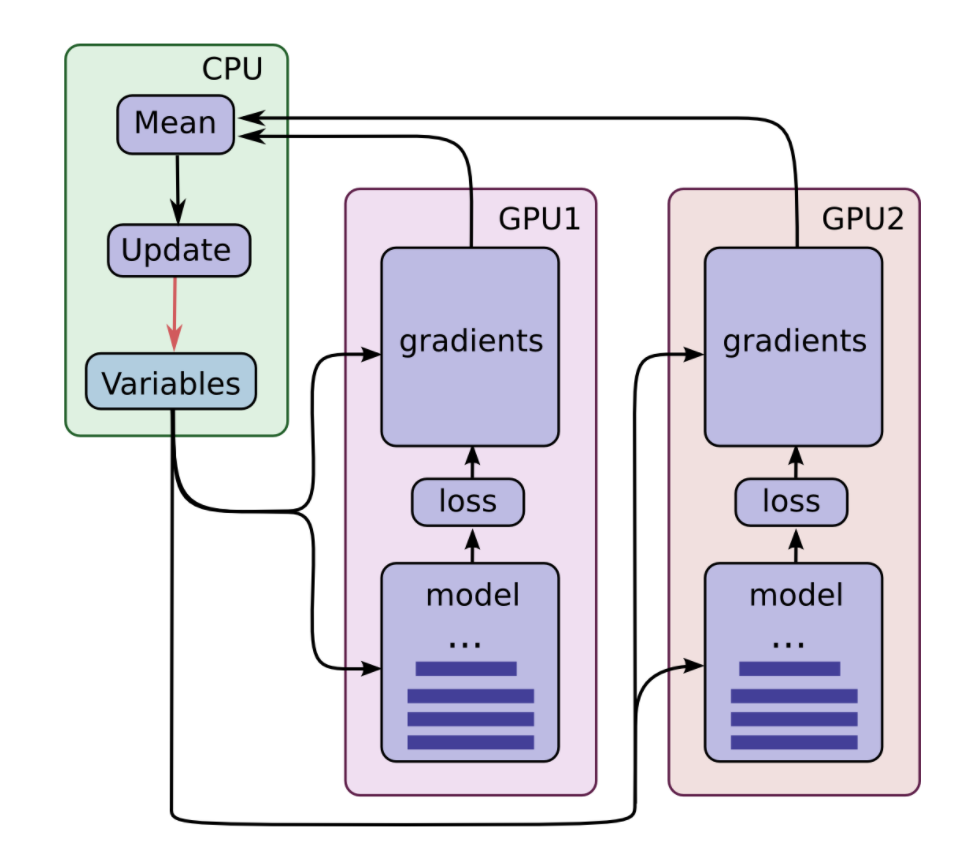

# tensorflow多GPU

## 获取可用GPU列表
	from tensorflow.python.client import device_lib
    local_device_protos = device_lib.list_local_devices()
    return [x.name for x in local_device_protos if x.device_type == 'GPU']

	使用os.environ["CUDA_VISIBLE_DEVICES"] = "1,2"指定GPU，在tensorflow中会重新从0开始编号，而不是使用nvidia-smi中GPU的编号
	如：
	os.environ["CUDA_VISIBLE_DEVICES"] = "4,5,6,7"
	获取的可用GPU列表为
	/device:GPU:0
	/device:GPU:0
	/device:GPU:0
	/device:GPU:0

## 指定tensorflow使用的GPU
指定tensorflow使用的GPU有三种方式：  
1. 终端执行程序时设置使用的GPU

	CUDA_VISIBLE_DEVICES=1 python my_script.py #只使用GPU1
	CUDA_VISIBLE_DEVICES=0,1 python my_script.py #使用GPU0,GPU1

	CUDA_VISIBLE_DEVICES=1           Only device 1 will be seen
	CUDA_VISIBLE_DEVICES=0,1         Devices 0 and 1 will be visible
	CUDA_VISIBLE_DEVICES="0,1"       Same as above, quotation marks are optional
	CUDA_VISIBLE_DEVICES=0,2,3       Devices 0, 2, 3 will be visible; device 1 is masked
	CUDA_VISIBLE_DEVICES=""          No GPU will be visible

2. python代码中设置使用的GPU

	import os
	os.environ["CUDA_VISIBLE_DEVICES"] = "1,2"

## 设置tensorflow使用的显存大小
1. 定量设置显存  
默认tensorflow是使用GPU尽可能多的显存。可以通过下面的方式，来设置使用的GPU显存  

	gpu_options = tf.GPUOptions(per_process_gpu_memory_fraction=0.7)
	sess = tf.Session(config=tf.ConfigProto(gpu_options=gpu_options))  #GPU实际显存*0.7

2. 按需设置显存

	gpu_options = tf.GPUOptions(allow_growth=True)
	sess = tf.Session(config=tf.ConfigProto(gpu_options=gpu_options))
   

## 使用多GPU
 如果您有多个GPU，默认情况下将选择ID最低的GPU。 但是，TensorFlow不会自动将操作放入多个GPU。 要覆盖设备放置以使用多个GPU，我们手动指定计算节点应运行的设备。  

	# 使用3个GPU来计算3个单独的矩阵乘法。 每次乘法生成2x2矩阵。 然后我们使用CPU对矩阵执行逐元素求和。
	import tensorflow as tf
	
	c = []
	for i, d in enumerate(['/gpu:0', '/gpu:1', '/gpu:2']):
	    with tf.device(d):
	        a = tf.get_variable(f"a_{i}", [2, 3], initializer=tf.random_uniform_initializer(-1, 1))
	        b = tf.get_variable(f"b_{i}", [3, 2], initializer=tf.random_uniform_initializer(-1, 1))
	        c.append(tf.matmul(a, b))
	
	with tf.device('/cpu:0'):
	    sum = tf.add_n(c)
	
	sess = tf.Session(config=tf.ConfigProto(log_device_placement=True))
	
	init = tf.global_variables_initializer()
	sess.run(init)
	
	print(sess.run(sum))

log_device_placement和allow_soft_placement参数：  
**log_device_placement**设置为True，记录操作是运行在CPU或GPU上    
如果希望在没有GPU或GPU较少的机器上运行相同的代码。 要处理多个设备配置，请将**allow_soft_placement**设置为True。 它会自动将操作放入备用设备中。 否则，如果设备不存在，操作将抛出异常。  

### 多GPU并行方式
多GPU并行有两种方式：模型并行和数据并行。  
如果主机具有多个具有相同内存和计算能力的GPU，则使用数据并行性进行扩展将更加简单。  

#### 1.模型并行 
不同的GPU运行代码的不同部分。 批量数据通过所有GPU。  

	# GPU 0负责矩阵乘法，GPU 1负责加法。
	import tensorflow as tf
	
	c = []
	a = tf.get_variable(f"a", [2, 2], initializer=tf.random_uniform_initializer(-1, 1))
	b = tf.get_variable(f"b", [2, 2], initializer=tf.random_uniform_initializer(-1, 1))
	
	with tf.device('/gpu:0'):
	    c.append(tf.matmul(a, b))
	
	with tf.device('/gpu:1'):
	    c.append(a + b)
	
	with tf.device('/cpu:0'):
	    sum = tf.add_n(c)
	
	sess = tf.Session(config=tf.ConfigProto(log_device_placement=True, allow_soft_placement=True))
	
	init = tf.global_variables_initializer()
	sess.run(init)
	
	print(sess.run(sum))

#### 2.数据并行
使用多个GPU来运行相同的TensorFlow代码。 每个GPU都提供不同批量的数据。

	# 我们运行模型的多个副本（称为towers）。 每个塔都分配给GPU。 每个GPU负责一批数据。
	import tensorflow as tf
	
	c = []
	a = tf.get_variable(f"a", [2, 2, 3], initializer=tf.random_uniform_initializer(-1, 1))
	b = tf.get_variable(f"b", [2, 3, 2], initializer=tf.random_uniform_initializer(-1, 1))
	
	# Multiple towers
	for i, d in enumerate(['/gpu:0', '/gpu:1']):
	    with tf.device(d):
	        c.append(tf.matmul(a[i], b[i]))   # Tower i is responsible for batch data i.
	
	with tf.device('/cpu:0'):
	    sum = tf.add_n(c)
	
	sess = tf.Session(config=tf.ConfigProto(log_device_placement=True, allow_soft_placement=True))
	
	init = tf.global_variables_initializer()
	sess.run(init)
	
	print(sess.run(sum))

如果所有GPU具有相同的计算和内存容量，我们可以使用多个towers来扩展解决方案，每个towers处理不同批次的数据。 如果GPU之间的数据传输速率相对较慢，我们会将模型参数固定到CPU上。 否则，我们将变量平均放在GPU上。 最终的选择取决于型号，硬件和硬件配置。 通常，通过基准测试来选择设计。 在下图中，我们将参数固定到CPU上。  
   
每个GPU计算特定批次数据的预测和梯度。 模型参数被固定到CPU上。 CPU等待所有GPU梯度计算，并对结果取平均值。 然后，CPU计算新的模型参数并更新所有GPU。   

tensorflow多GPU训练参考代码：https://github.com/tensorflow/models/blob/master/tutorials/image/cifar10/cifar10_multi_gpu_train.py

	

# 参考
https://jhui.github.io/2017/03/07/TensorFlow-GPU/